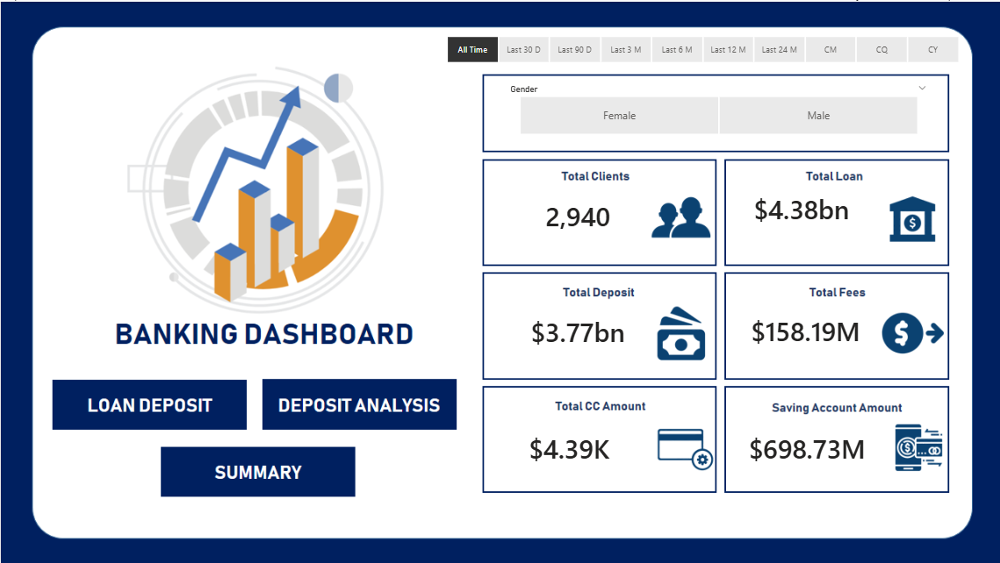
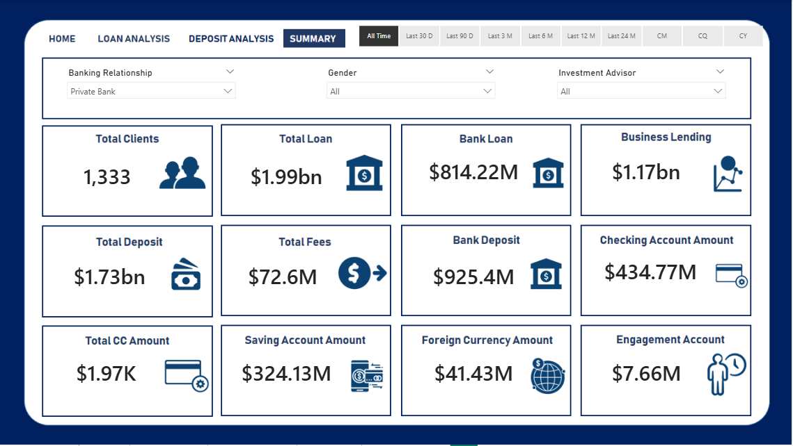

## Banking Insights and Decision Support System

SQL · Power BI · Python · Data Modelling

A comprehensive banking analytics project analyzing 3,000 loan applications worth $435.8M to surface portfolio risk, borrower trends, and financial KPIs for data-driven decision-making.


## Business Problem

A financial institution required a centralized analytics solution to monitor loan performance, identify risky lending patterns, and improve visibility into customer borrowing behaviour across multiple loan categories.


## Project Overview

This project builds an end-to-end analytics pipeline on a real-world banking loan dataset — from raw data cleaning in Python to SQL-based KPI calculations to interactive Power BI dashboards — designed to give a bank's risk and operations team a single source of truth for portfolio health.


## Key Insights Uncovered

- $435.8M total funded vs $473.1M total received — healthy repayment spread
- 13.8% bad loan ratio — isolating $64.9M in non-performing assets for risk mitigation
- 6.9% MoM increase in loan application volume — portfolio growth signal
- Average Debt-to-Income (DTI) ratio of 13.3% across all borrowers
- Loan grade, home ownership, and purpose are the strongest risk predictors


## Project Structure

│── Banking.csv                  ← Raw dataset (3,000 records) |

│── Banking.xlsx                 ← Cleaned dataset |

│── Banking.ipynb                ← Data cleaning & preprocessing |

│── EDA.ipynb                    ← Exploratory Data Analysis |

│── banking_sql_queries.sql      ← Data Analysis & KPI Generation |

│── Banking Dashboard.pbix       ← Power BI dashboard |

│── Home.png                     ← Dashboard screenshot — Summary view |

│── Deposit Analysis.png         ← Dashboard screenshot — Deposit analysis |

│── Loan Analysis.png            ← Dashboard screenshot — Loan analysis |

│── Drill Through.png            ← Dashboard screenshot — Drill-through view |

│── README.md |


## Dataset Overview - Banking.csv

### Field - Description

Source - Simulated banking CRM dataset |

File Formats - Banking.csv |

Records - 3,000 customers |

Features - 25 columns |

Missing Values - None (clean dataset) |

Time Period - Multi-year |


## Key Performance Indicators (KPIs)

### KPI - Value |

Total Customers - 3,000 |

Total Bank Deposits - $2.01 Billion |

Total Bank Loans - $1.77 Billion |

Loan-to-Deposit Ratio (LDR) - 0.88 |

Avg Deposit per Customer - $671,560 |

Avg Loan per Customer - $591,386 |

Total Credit Card Balance - $9.53 Million |

Total Business Lending - $2.60 Billion |

Total Savings Accounts Balance - $698.7 Million |

Total Checking Accounts Balance - $963.3 Million |

Avg Estimated Income - $171,305 |

Avg Properties Owned - 1.52 |

High-Value Customers (Deposits > $500K) - 1,420 (47.3%) |

Avg Customer Age - 51 years |


## Dashboard Preview

Home


Loan Analysis


Deposit Analysis


Summary


Drill Through 


## Sample SQL Queries Used

sql

-- Monthly loan application trend

SELECT
    DATE_FORMAT(issue_date, '%Y-%m') AS month,
    COUNT(*) AS total_applications,
    SUM(loan_amount) AS total_funded
FROM banking
GROUP BY month
ORDER BY month;

-- Bad loan ratio by grade

SELECT
    grade,
    COUNT(*) AS total_loans,
    SUM(CASE WHEN loan_status IN ('Charged Off', 'Default') THEN 1 ELSE 0 END) AS bad_loans,
    ROUND(100.0 * SUM(CASE WHEN loan_status IN ('Charged Off', 'Default') THEN 1 ELSE 0 END) / COUNT(*), 2) AS bad_loan_pct
FROM banking
GROUP BY grade
ORDER BY bad_loan_pct DESC;

-- Average DTI by home ownership

SELECT
    home_ownership,
    ROUND(AVG(dti), 2) AS avg_dti,
    COUNT(*) AS applicant_count
FROM banking
GROUP BY home_ownership;


## Tech Stack

### Tools & Purpose-

Python - (Pandas, NumPy) - Data cleaning & preprocessing , (Matplotlib, Seaborn) - EDA visualizations |

SQL (MySQL) - KPI queries & aggregations |

Power BI + DAX - Interactive dashboards |

Jupyter Notebook - Analysis environment |


## Business Impact

Enabled faster monitoring of loan portfolio health and lending performance. |

Helped simulate data-driven decision-making for credit risk assessment and operational reporting. |


## How to Run

### 1. Clone the Repository
```bash
git clone https://github.com/BeHarsha/Banking_Insights_and_Decision_Support_System
cd Banking_Insights_and_Decision_Support_System
```

### 2. Install Python Dependencies
```bash
pip install pandas numpy matplotlib seaborn
```

### 3. Run the Python Analysis

Launch Jupyter Notebook and open either `EDA.ipynb` or `Banking.ipynb` to explore the data and run the full analysis:
```bash
EDA.ipynb
```

### 4. Run the SQL Queries

Open `banking_sql_queries.sql` in your preferred SQL environment (MySQL Workbench, pgAdmin, DBeaver, or any compatible SQL client). 

Import the dataset (`Banking.csv` or `Banking.xlsx`) into your database, then execute the queries to extract insights and perform data transformations.

### 5. View the Power BI Dashboard
Open `Banking Dashboard.pbix` in Power BI Desktop to explore the interactive visualizations covering loan analysis, deposit trends, and key performance indicators.

## Author

Bethineedi Deva Harsha
- [LinkedIn](https://www.linkedin.com/in/bethineedi-deva-harsha-3933aa2a9)
- [GitHub](https://github.com/BeHarsha)
- harsha.fieldmaster@gmail.com
